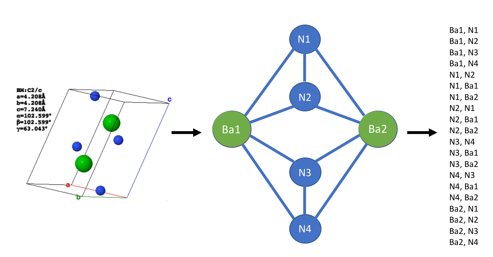

SkipAtom
========

SkipAtom is an approach for creating distributed representations of atoms, for use in Machine Learning contexts. It is
based on the Skip-gram model used widely in Natural Language Processing. The SkipAtom approach is described in the 
paper _"Distributed Representations of Atoms and Materials for Machine Learning"_,
[https://arxiv.org/abs/2107.14664](https://arxiv.org/abs/2107.14664).

SkipAtom can be installed with:
```
pip install skipatom
```
However, this will install a minimal implementation that can be used to work with existing SkipAtom embeddings only. To 
train new embeddings, SkipAtom should be installed with:
```
pip install skipatom[training]
```

Pre-trained 30- and 200-dimensional SkipAtom vectors for 86 atom types are available in the `data` directory, 
in the `mp_2020_10_09.dim30.model` and `mp_2020_10_09.dim200.model` files. To use the pre-trained vectors, follow the 
example in step 4, below.

To create SkipAtom vectors, follow steps 1 to 3 below. A dataset of inorganic crystal structures is required. A dataset 
of 126,335 structures obtained from the [Materials Project](https://materialsproject.org/) is available in 
`data/mp_2020_10_09.pkl.gz`.  From this dataset, pairs of co-occurring atoms will be derived, as depicted in the 
schematic below:



These pairs will be used in the training of the SkipAtom vectors. Pairs that were previously derived from the 
Materials Project dataset are available in the file `data/mp_2020_10_09.pairs.csv.gz`.

_(NOTE: For the following steps 1 to 3, the programs `create_cooccurrence_pairs`, `create_skipatom_training_data` and 
`create_skipatom_embeddings` are installed as console scripts when using `pip install skipatom`, and will be usable if 
SkipAtom was installed with `pip install skipatom[training]`.)_

1. Create the co-occurrence pairs:
```
$ create_cooccurrence_pairs \
--data data/mp_2020_10_09.pkl.gz \
--out data/mp_2020_10_09.pairs.csv.gz \
--processes 70 --workers 200 -z
```
<sup>NOTE: Creating the pairs is the most computationally demanding step, and is accelerated by the availability 
of multiple cores.</sup>

2. Prepare the data for training:
```
$ create_skipatom_training_data \
--data data/mp_2020_10_09.pairs.csv.gz \
--out data/mp_2020_10_09.training.data
```

3. Create the SkipAtom embeddings:
```
$ create_skipatom_embeddings \
--data data/mp_2020_10_09.training.data \
--out data/mp_2020_10_09.dim200.model \
--dim 200 --step 0.01 --epochs 10 --batch 1024
```

4. Load and use the model:
```python
from skipatom import SkipAtomInducedModel

model = SkipAtomInducedModel.load(
    "data/mp_2020_10_09.dim200.model", 
    "data/mp_2020_10_09.training.data", 
    min_count=2e7, top_n=5)

# atom vector for Si
print(model.vectors[model.dictionary["Si"]])
```
The `model.vectors` will be a NumPy `ndarray`, with dimensions _`N` x `M`_, where _`N`_ is the number of atom
types, and _`M`_ is the number of embedding dimensions (e.g. 200). The `model.dictionary` maps an atom's symbol to 
its index in the `model.vectors` array.

There are two kinds of SkipAtom models available: `SkipAtomModel` and `SkipAtomInducedModel`. The `SkipAtomModel` class
does not perform the induction step when the embeddings are loaded. The `SkipAtomInducedModel` must be used to obtain
the induced embeddings. The induction step can be tuned using the `min_count` and `top_n` parameters when loading the 
embeddings. 

### Pooling Operations

The `skipatom` module also contains several utility functions for pooling atom vectors into distributed representations 
of compounds. For example, to create a sum-pooled representation for `Bi2Te3`, use the `sum_pool` function:
```python
from skipatom import SkipAtomInducedModel, sum_pool
from pymatgen import Composition

model = SkipAtomInducedModel.load(
    "data/mp_2020_10_09.dim200.model", 
    "data/mp_2020_10_09.training.data", 
    min_count=2e7, top_n=5)

comp = Composition("Bi2Te3")
pooled = sum_pool(comp, model.dictionary, model.vectors)
# sum-pooled atom vectors representing Bi2Te3 
print(pooled)
``` 

### Neural Network Models

The `skipatom` module contains Keras-based implementations of an ElemNet-type neural network (for both 
regression and classification), and the Elpasolite neural network described by Zhou et al, in 2018. To use these, it is
necessary to have `tensorflow` in the environment. (Have a look at either the `requirements.txt` file or the 
`environment.yml` file for a full list of dependencies.) The neural networks are implemented in the `ElemNet`, 
`ElemNetClassifier`, and `ElpasoliteNet` classes.

For more information regarding these models, see:

> Jha, D., Ward, L., Paul, A., Liao, W. K., Choudhary, A., Wolverton, C., & Agrawal, A. (2018). "ElemNet: Deep Learning 
the Chemistry of Materials From only Elemental Composition." Scientific reports, 8(1), 1-13.

> Zhou, Quan, et al. "Learning atoms for materials discovery."
Proceedings of the National Academy of Sciences 115.28 (2018): E6411-E6417. 

### One-hot Vectors

For convenience, a class for assigning one-hot vectors to atoms is included in the `skipatom` module. The following 
example demonstrates how to use the class:
```python
from skipatom import OneHotVectors

model = OneHotVectors(["Te", "Bi", "Se"])

# one-hot atom vector for Se
print(model.vectors[model.dictionary["Se"]])
# [0. 0. 1.]
```

### Random Vectors

For convenience, a class for assigning random vectors to atoms is included in the `skipatom` module. The following 
example demonstrates how to use the class:
```python
from skipatom import RandomVectors

model = RandomVectors(elems=["Te", "Bi", "Se"], dim=5, mean=0.0, std=1.0)

# random atom vector for Se
print(model.vectors[model.dictionary["Se"]])
# [ 1.00470084  0.64535562 -1.1116041   1.12440526 -1.66262765]
```

### Generic Atom Vectors

A class for loading pre-trained/existing atom vectors is included in the `skipatom` module. The following example 
demonstrates loading Mat2Vec vectors from a file (included in this repository):
```python
from skipatom import AtomVectors

model = AtomVectors.load("data/mat2vec.dim200.model")

# Mat2Vec atom vector for Se
print(model.vectors[model.dictionary["Se"]])
# [0.5476523637771606, 0.28294137120246887, -0.1327364146709442, ...
```
Files containing pre-trained Atom2Vec vectors are also included in the `data` folder in this repository, and can be 
used in the same way.

### Performing the Experiments in the Paper

To perform the experiments in the [SkipAtom paper](https://arxiv.org/abs/2107.14664), follow the steps outlined in this 
section. Note that you must have a Python environment with tensorflow 2.3 and scikit-learn 0.24, in addition to the 
skipatom library and its dependencies. 

#### Performing experiments with the MatBench datasets

To perform experiments with the MatBench datasets, the data files of interest will first need to be downloaded from 
https://hackingmaterials.lbl.gov/automatminer/datasets.html#accessing-the-ml-tasks. 

Once the MatBench data file for a task of interest is downloaded, use it to create a dataset that can be utilized to 
train an ElemNet-like model. This file will contain the input representations for the model, as well as the 
corresponding target values. From the root of this project:
```
$ python bin/create_matbench_dataset.py \
--data out/matbench_expt_gap.json.gz \
--out out/one_hot_matbench_expt_gap.pkl.gz \
--atoms data/atoms.txt \
--representation one-hot \
--pooling sum
```  
The command above assumes that the MatBench data file, `matbench_expt_gap.json.gz`, is in a directory named `out`. Also,
an `atoms.txt` file must be provided, listing the atoms supported (an example file exists in the `data` directory).
The `--out` argument accepts the location of the resulting dataset file. Note that it will be a gzipped file. Finally, 
the type of representation to use, and the pooling operation to use, must also be specified.

Once the dataset file is generated, train and evaluate the model using repeated k-fold cross-validation. From the root 
of this project:
```
$ python bin/train_mlp.py \
--dataset out/one_hot_matbench_expt_gap.pkl.gz \
--architecture elemnet \
--results out/results \
--models out/models
```
Since the MatBench tasks described in the paper make use of an ElemNet-like architecture, the `--architecture` 
argument is given `elemnet`. Two directories, in this example, `out/results` and `out/models`, must
already exist before `train_mlp.py` is invoked. They will be where the .csv results file and the best models will be 
placed, respectively. The `train_mlp.py` program also accepts arguments for specifying the number of splits, the batch 
size, etc.

#### Performing experiments with the Elpasolite dataset

To perform experiments with the Elpasolite dataset, a pre-processed data file included in this project, 
`data/abc2d6_training.pkl`, can be utilized. A dataset that can be utilized with the ElpasoliteNet model must 
first be generated. From the root of this project:
```
$ python bin/create_elpasolite_dataset.py \
--data data/abc2d6_training.pkl \
--out out/one_hot_elpasolite.pkl.gz \
--atoms data/atoms.txt \
--representation one-hot
```
The command above utilizes the existing data file, `abc2d6_training.pkl`. Also, an `atoms.txt` file must be 
provided, listing the atoms supported (an example file exists in the `data` directory). The `--out` argument accepts 
the location of the resulting dataset file. Note that it will be a gzipped file. Finally, the type of representation 
to use must also be specified.

Once the dataset file is generated, train and evaluate the model using k-fold cross-validation. From the root of this 
project:
```
$ python bin/train_mlp.py \
--dataset out/one_hot_elpasolite.pkl.gz \
--architecture elpasolite \
--results out/results \
--models out/models
```
We must use the ElpasoliteNet architecture, hence the `--architecture` argument is given `elpasolite`.
Two directories, in this example, `out/results` and `out/models`, must already exist before `train_mlp.py` is invoked. 
They will be where the .csv results file and the best models will be placed, respectively. The `train_mlp.py` program 
also accepts arguments for specifying the number of splits, the batch size, etc.

#### Performing experiments with the OQMD dataset

To perform experiments with the OQMD dataset, a pre-processed file included in this project, 
`data/oqmd-dataset-processed.csv`, can be utilized. A dataset that can be utilized with the ElemNet-like architecture 
must first be generated. From the root of this project:
```
$ python bin/create_oqmd_dataset.py \
--data data/oqmd-dataset-processed.csv \
--out out/one_hot_oqmd.pkl \
--atoms data/atoms.txt \
--representation one-hot \
--pooling sum
```
The command above utilizes the existing data file, `oqmd-dataset-processed.csv`. Also, an `atoms.txt` file must be 
provided, listing the atoms supported (an example file exists in the `data` directory). The `--out` argument accepts 
the location of the resulting dataset file. Note that it will *not* be a gzipped file. Finally, 
the type of representation to use, and the pooling operation to use, must also be specified.

Once the dataset file is generated, train and evaluate the model using k-fold cross-validation. From the root of this 
project:
```
$ python bin/train_mlp.py \
--dataset out/one_hot_oqmd.pkl \
--architecture elemnet \
--results out/results \
--models out/models
```
Since the OQMD task described in the paper make use of an ElemNet-like architecture, the `--architecture` 
argument is given `elemnet`. Two directories, in this example, `out/results` and `out/models`, must
already exist before `train_mlp.py` is invoked. They will be where the .csv results file and the best models will be 
placed, respectively. The `train_mlp.py` program also accepts arguments for specifying the number of splits, the batch 
size, etc.

- - - - - - - - -

This repository includes data from the [Materials Project](https://materialsproject.org/). 
> A. Jain*, S.P. Ong*, G. Hautier, W. Chen, W.D. Richards, S. Dacek, S. Cholia, D. Gunter, D. Skinner, G. Ceder, K.A. 
Persson (*=equal contributions). The Materials Project: A materials genome approach to accelerating materials innovation.
APL Materials, 2013, 1(1), 011002.

This repository includes data from the [OQMD database](http://oqmd.org/).
>  Saal, J. E., Kirklin, S., Aykol, M., Meredig, B., and Wolverton, C. "Materials Design and Discovery with 
>High-Throughput Density Functional Theory: The Open Quantum Materials Database (OQMD)", JOM 65, 1501-1509 (2013).

This repository includes data from https://doi.org/10.1103/PhysRevLett.117.135502.
> Faber, F. A., Lindmaa, A., Von Lilienfeld, O. A., & Armiento, R. (2016). Machine Learning Energies of 2 Million 
>Elpasolite (ABC2D6) Crystals. Physical Review Letters, 117(13), 135502.
